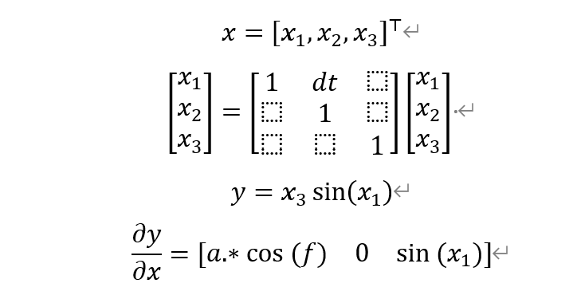

Sequential State Estimator Toolbox for Matlab
==
This project is based on code from the [ekf_ukf](https://github.com/EEA-sensors/ekfukf)] repository by ANYbotics. Many thanks to the authors, [Simo Särkkä](http://users.aalto.fi/~ssarkka/), Jouni Hartikainen, and [Arno Solin](http://arno.solin.fi), for their contributions. 

Demos
--
There are a number of demonstration programs for the provided filters and smoothers. The code and a short introduction to them are given below. All of the demonstration programs are discussed in the documentation.

Demonstration programs for linear state-space models:

* 2D CWPA-model, `kf_cpwa_demo`

Demonstration programs for non-linear state-space models:

* Tracking a random sine signal, `ekf_sine_demo`

* UNGM-model, `ungm_demo`
* Bearings only tracking, `bot_demo`
* Reentry vehicle tracking, `reentry_demo`

Demonstration programs for multiple model systems:

* Tracking a target with simple manouvers, `imm_demo`
* Coordinated turn model, `ct_demo`
* Bearings only tracking of a manouvering target, `botm_demo`
